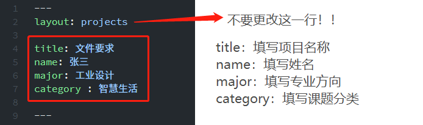
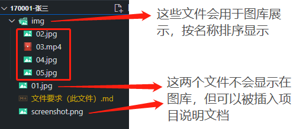
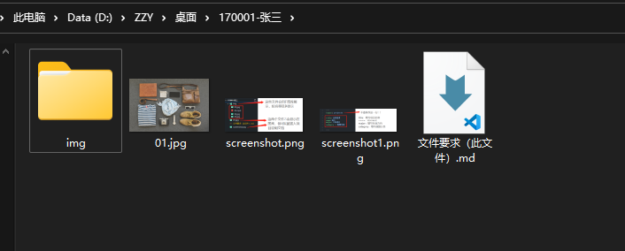

## 项目介绍（这是一个二级标题）

在此处填写项目的介绍文字，使用纯文本编辑器进行编辑

（不要用 MS Office Word 等软件直接编辑，可以在编辑完成后将文本粘贴至`记事本`，`VS Studio Code`等纯文本编辑器之后再保存）

将一段介绍文字填写至此处即可，每个段落之间用一个空行隔开。

使用`utf-8`编码保存文件

**更改此文件顶部的项目信息**

他们将会显示在你项目页面的顶部



**提交的文件夹的结构如下：**



windows下的项目文件夹：



### 如何提交项目图片（！！重要！！）

- 请将需要提交的图片与视频保存在`img`文件夹内，它们将会用于项目图库的展示  
- 在项目页面上这些图片将会按照该文件夹中**文件名的顺序排列**，**第一张图片将作为项目封面**，所以请注意图片文件的名称
- 在此案例中 **`02.jpg`将会作为项目封面**，同时在**第二张图片的位置将会播放演示视频**
- 将项目文件夹命名为**学号-姓名**，如**170001-张三**，并打包发送

> 关于提交文件的格式：  
> markdown 文件请使用纯文本编辑器使用 utf-8 编码进行保存，后缀名 .md 或 .markdown均可  
> 图片可以接受的格式：.jpg .png，考虑到网络传输，分辨率尽量不要超过300ppi  
> 视频可以接受的格式：h.264 编码的 .mp4 文件，同样考虑到网络传输，码率尽量不要大于10mbps，分辨率不要超过 1080p

___

### 以上，最基本的项目文件编辑就完成了，如果你想要图文混排展示或尝试更复杂的版式的话，可以根据markdown文件格式自行尝试排版。

**以下是一些常用markdown格式参考**

**更加详细的教程可以参考[Markdown 教程 \| 菜鸟教程](https://www.runoob.com/markdown/md-tutorial.html)**

___

### 使用`井号（#）`创建标题

使用二至六个井号跟上一个空格可以创建二级至六级标题：

## 这是二级标题

### 这是三级标题

#### 这是四级标题

##### 这是五级标题

###### 这是六级标题

**以上段落的markdown文本如下**

```
## 这是二级标题

### 这是三级标题

#### 这是四级标题

##### 这是五级标题

###### 这是六级标题
```

> 注意：请不要在页面内部创建一级标题

____

### 使用`减号（-）`创建无序列表

- 输入`-`加上一个空格可以创建无序列表项
- 这是第二项
- 这是第三项
  - 在项目前添加两个空格的缩进可以对列表进行嵌套
  - 这是嵌套第二项
  - 第三项
    - 三级嵌套
- 这是第四项

**以上段落的markdown文本如下**

```
- 输入`-`加上一个空格可以创建无序列表项
- 这是第二项
- 这是第三项
  - 在项目前添加两个空格的缩进可以对列表进行嵌套
  - 这是嵌套第二项
  - 第三项
    - 三级嵌套
- 这是第四项
```

___

### 使用`数字（1.）`创建有序列表

1. 输入`1.`数字加上点和一个空格可以创建有序列表项
2. 这是第二项
3. 这是第三项
4. 这是第四项

**以上段落的markdown文本如下**

```
1. 输入`1.`数字加上点和一个空格可以创建有序列表项
2. 这是第二项
3. 这是第三项
4. 这是第四项
```

___

### 行內元素強調

- 使用一个星号`*`包裹文字可以打出*斜体*
- 使用两个星号`**`包裹文字，可以打出**粗体**
- 使用三个星号`***`包裹文字，可以打出***粗斜体***
- 使用反引号``` 包裹文字，可以使其`高亮`
- 使用大于号`>`开始一个段落，可以添加注释
> 这是一段注释

**以上段落的markdown文本如下**

```
- 使用一个星号`*`包裹文字可以打出*斜体*
- 使用两个星号`**`包裹文字，可以打出**粗体**
- 使用三个星号`***`包裹文字，可以打出***粗斜体***
- 使用反引号``` 包裹文字，可以使其`高亮`
- 使用大于号`>`开始一个段落，可以添加注释
> 这是一段注释
```

___

### 插入图片和链接

使用`` 在文章当中插入图片

感叹号`!`接方括号内的图片描述（可以任意填写，只是用来标识用），再接括号括起来的图片链接

> 注意：请填写图片正确的相对路径，如：  
> 与此文档在同一文件夹下的`01.jpg`，其路径就是`01.jpg`  
> 在`img`文件夹下的`04.jpg`，其路径则应当填写`img/04.jpg`

**下图的markdown文本如下**

```

```

> 它不会被显示在项目图库当中


**下图的markdown文本如下**

```

```

> 因为它被储存在`img`文件夹下，所以它会显示在页面顶部的项目图库中

